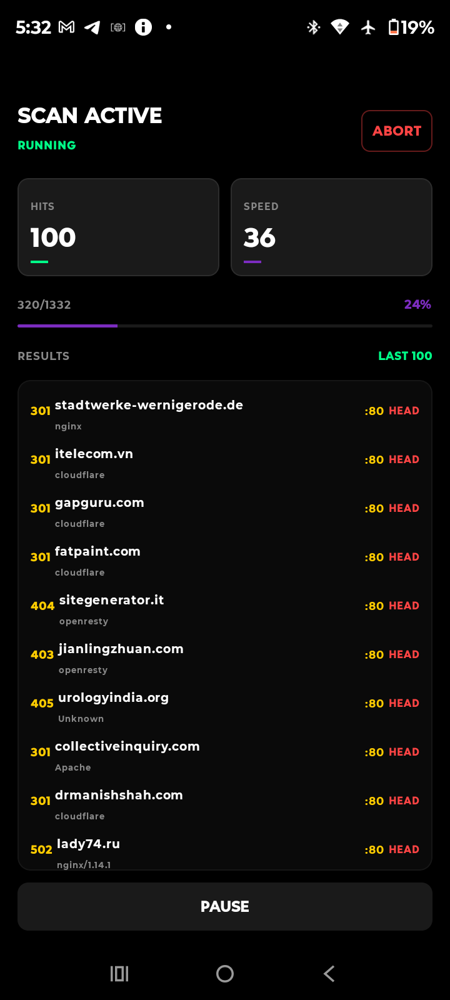
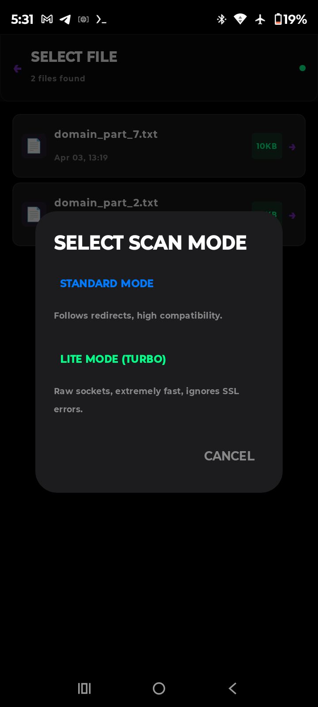
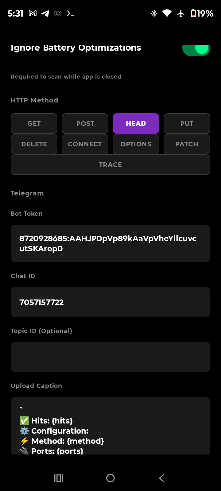
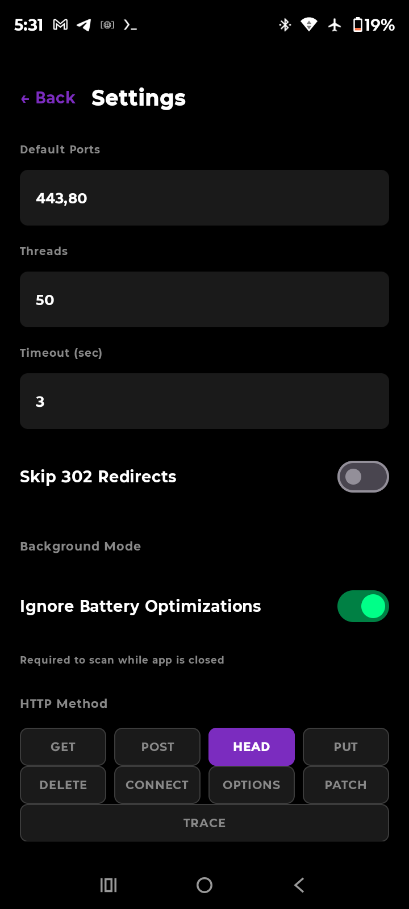
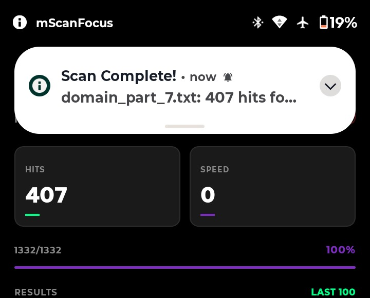
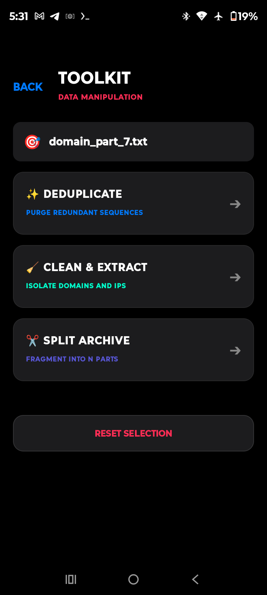
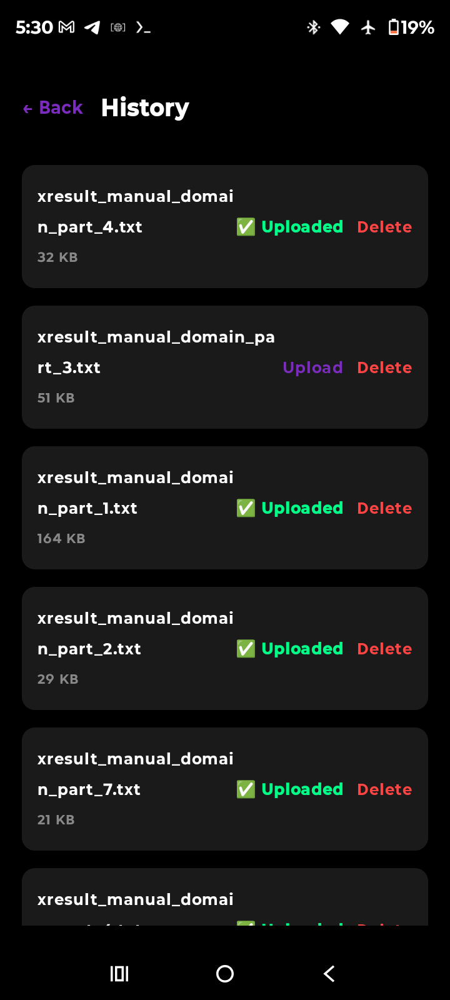

  
   
  
  

<h1 align="center">mScanFocus</h1>

  <b>The Elite Network Discovery & HTTP Analysis Suite for Android</b> 
  Designed for speed. Optimized for precision. Built for professionals.

  

  <a href="#-technology">Technology</a> •
  <a href="#-gallery">Gallery</a> •
  <a href="#-deployment">Deployment</a> •
  <a href="https://t.me/mscanfocus">Support</a>

---

## 💎 The Gold Standard in Mobile Scanning

mScanFocus is not just a tool; it is a high-performance scanning ecosystem. By combining **Raw Socket Level connectivity** with the robustness of **Standard HTTP Clients**, we provide a scanning experience previously only possible on desktop environments.

### 🚀 Dual-Engine Hybrid Technology
*   **Lite Mode (Turbo):** Custom-engineered **TCP Socket Orchestration** that bypasses the JVM's standard network overhead for extreme throughput. Implements a specialized **Unsafe SSL/TLS Handshake Bypass**, enabling data extraction from hardened, legacy, or misconfigured servers.
*   **Standard Mode (Advanced):** A high-fidelity **Protocol Emulation Engine** built on a hardened OkHttp foundation. Utilizes **Custom Interceptor Chains** for precise header synthesis and forensic-level response analysis.

### 🎯 Intelligent Redirection Logic (302)
Automate your workflow with selective 302 handling. Automatically filter out ISP recharge portals and regional redirection while preserving valid hits.

---

## 📸 Pro Gallery

<table align="center">
  <tr>
    <td width="33%"></td>
    <td width="33%"></td>
    <td width="33%"></td>
  </tr>
  <tr align="center">
    <td><b>Command Center</b> <small>Modular Dashboard</small></td>
    <td><b>Post-Scan Analytics</b> <small>Completion Summary</small></td>
    <td><b>Deep Configuration</b> <small>Granular Engine</small></td>
  </tr>
  <tr>
    <td width="33%"></td>
    <td width="33%"></td>
    <td width="33%"></td>
  </tr>
  <tr align="center">
    <td><b>Real-time Telemetry</b> <small>Background Scanning</small></td>
    <td><b>Data Intelligence</b> <small>High-Fidelity Extraction</small></td>
    <td><b>The Pro Toolkit</b> <small>Optimization Utilities</small></td>
  </tr>
  <tr>
    <td width="33%"></td>
    <td width="33%"></td>
    <td width="33%"></td>
  </tr>
  <tr align="center">
    <td><b>Archive Intelligence</b> <small>Centralized Log Vault</small></td>
    <td><b>Live Engine</b> <small>Turbo-threaded Stream</small></td>
    <td><b>Engine Orchestration</b> <small>Dual-Mode Toggle</small></td>
  </tr>
</table>

---

## 📦 Deployment & Setup

This repository is maintained as a **Landing Page & Release Distribution Point**. The source code is maintained in a private secure environment.

### Installation
1.  Navigate to the **[Releases](https://github.com/mwmQi/mscanfocus-app/releases)** section of this repository.
2.  Download the latest production-ready `.apk` file.
3.  Ensure "Unknown Sources" is enabled in your Android security settings.
4.  Install and launch the mScanFocus Command Center.

### System Requirements
*   **OS:** Android 11.0 (API 30) or higher.
*   **Hardware:** Optimized for ARM64-v8a architecture.
*   **Storage:** Minimal footprint (~15MB for APK).

---

  <b>Developed by <a href="https://github.com/mwmQi">mwmQi</a></b> 
  <i>Leading the edge in mobile network security tools.</i>

  

